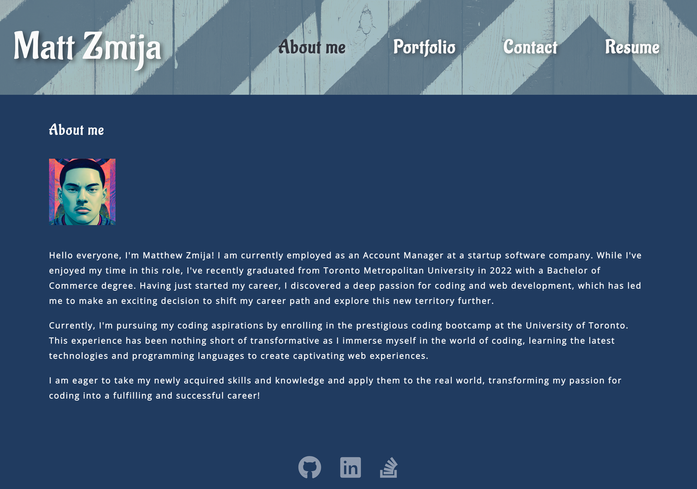

# React-Portfolio

## Description

The task at hand was to create a portfolio using my newfound React skills. This was done in hopes of setting myself apart from other developers whose portfolios don’t use the latest technologies.

## Usage

The landing page of the portfolio features my name along with an "About me" section being immediately displayed. The user would then have the ability to use the navigation tiles at the top of the page to change the content that is displayed without reloading, allowing for a better and cleaner experience for the user.

## URL of GitHub repository

https://github.com/matthewzmija/React-Portfolio

## URL of deployed application

https://matthewzmija.github.io/React-Portfolio/

## Reference with starter code and mockup

https://utoronto.bootcampcontent.com/utoronto-bootcamp/UTOR-VIRT-FSF-PT-02-2023-U-LOLC/-/tree/main/20-React/02-Challenge

## License

MIT
